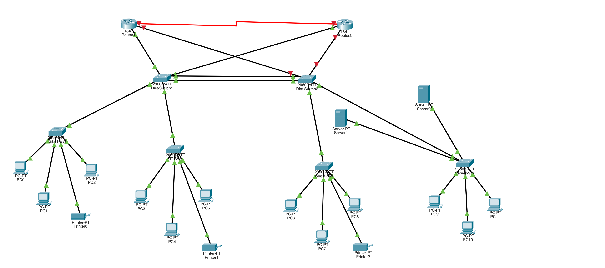
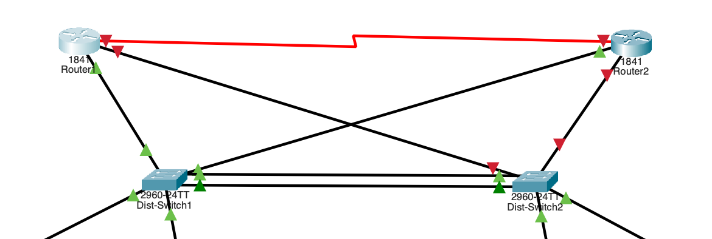
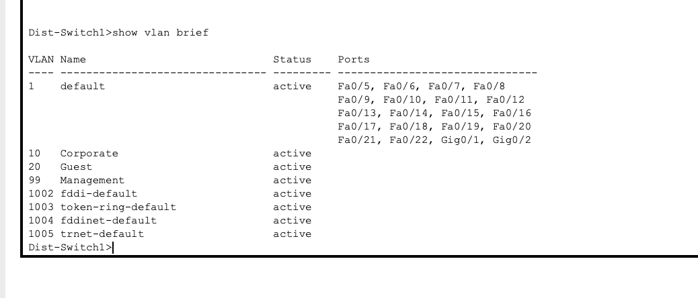
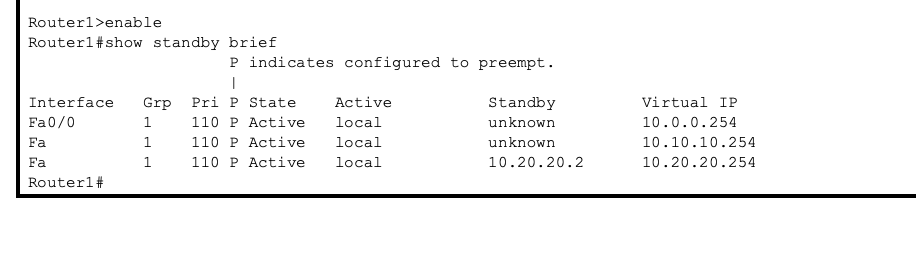
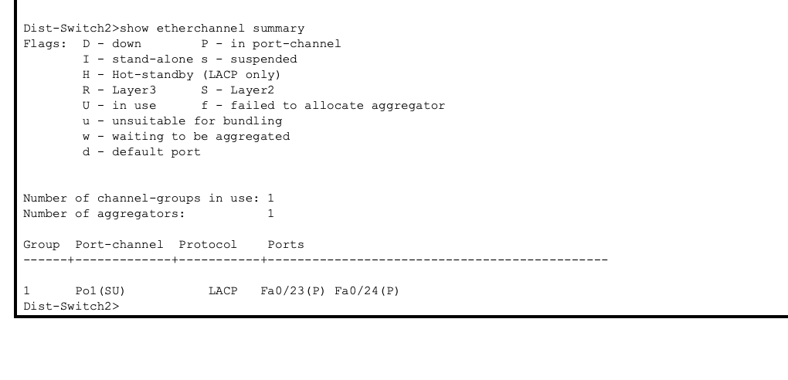
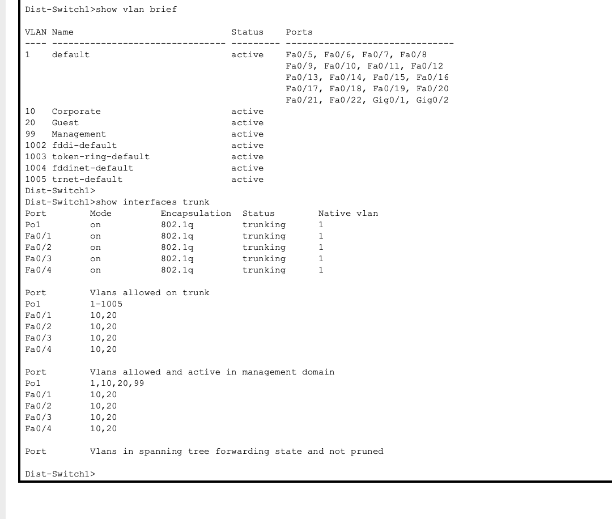
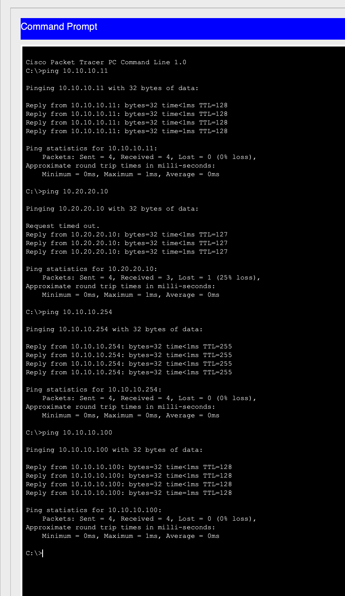
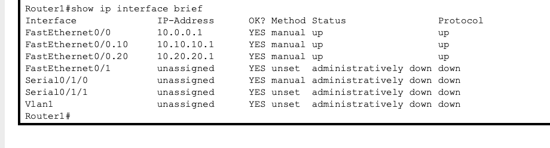

## 📸 Project Screenshots

### Full Network Topology

### Core Infrastructure (Routers + Distribution Switches)

### VLAN Configuration

### HSRP Router Redundancy

### EtherChannel Link Aggregation

### Trunk Port Configuration

### Successful Connectivity Tests

### Router Interface Status

